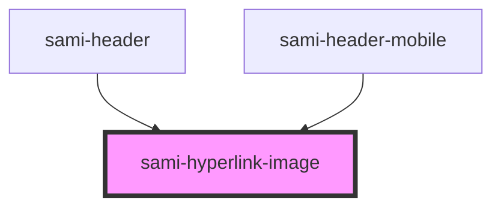

# sami-hyperlink-image


<!-- Auto Generated Below -->


## Usage

### Angular

```html
<!-- Tag Card With Number -->
<sami-card-tag text="1"></sami-card-tag>
```


## Properties

| Property          | Attribute          | Description                                                                                   | Type         | Default     |
| ----------------- | ------------------ | --------------------------------------------------------------------------------------------- | ------------ | ----------- |
| `background`      | `background`       |                                                                                               | `string`     | `undefined` |
| `backgroundImage` | `background-image` |                                                                                               | `string`     | `undefined` |
| `borderRadius`    | `border-radius`    |                                                                                               | `string`     | `undefined` |
| `filter`          | `filter`           |                                                                                               | `string`     | `undefined` |
| `height`          | `height`           |                                                                                               | `string`     | `undefined` |
| `maxWidth`        | `max-width`        |                                                                                               | `string`     | `undefined` |
| `padding`         | `padding`          | es: Ruta que redirige del card image en: Route of redirect card image Example: localhost/css3 | `string`     | `undefined` |
| `refFunction`     | --                 |                                                                                               | `() => void` | `()=>{}`    |
| `target`          | `target`           |                                                                                               | `string`     | `"_self"`   |
| `text`            | `text`             | es: Ruta que redirige del card image en: Route of redirect card image Example: localhost/css3 | `string`     | `''`        |
| `url`             | `url`              | es: Ruta que redirige del card image en: Route of redirect card image Example: localhost/css3 | `string`     | `'#'`       |
| `width`           | `width`            |                                                                                               | `string`     | `undefined` |


## Dependencies

### Used by

 - [sami-header](../../../organims/headers/header)
 - [sami-header-mobile](../../../organims/headers/header-mobile)

### Graph


----------------------------------------------

*Built with [StencilJS](https://stenciljs.com/)*
