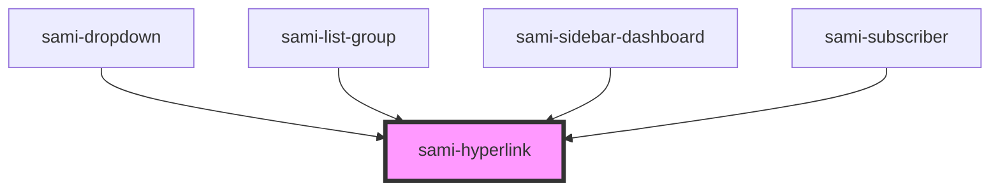

# sami-hyperlink


<!-- Auto Generated Below -->


## Usage

### Angular

```html
<!-- Tag Card With Number -->
<sami-card-tag text="1"></sami-card-tag>
```


## Properties

| Property  | Attribute | Description                                                                                   | Type         | Default     |
| --------- | --------- | --------------------------------------------------------------------------------------------- | ------------ | ----------- |
| `fnClick` | --        |                                                                                               | `() => void` | `() => { }` |
| `padding` | `padding` | es: Ruta que redirige del card image en: Route of redirect card image Example: localhost/css3 | `string`     | `undefined` |
| `target`  | `target`  |                                                                                               | `string`     | `"_self"`   |
| `text`    | `text`    | es: Ruta que redirige del card image en: Route of redirect card image Example: localhost/css3 | `string`     | `''`        |
| `url`     | `url`     | es: Ruta que redirige del card image en: Route of redirect card image Example: localhost/css3 | `string`     | `'#'`       |
| `width`   | `width`   |                                                                                               | `string`     | `undefined` |


## Dependencies

### Used by

 - [sami-dropdown](../../../molecules/dropdowns/dropdown)
 - [sami-list-group](../../../molecules/lists/list-group)
 - [sami-sidebar-dashboard](../../../organims/sidebars/sidebar-dashboard)
 - [sami-subscriber](../../../organims/subscribers/subscriber)

### Graph


----------------------------------------------

*Built with [StencilJS](https://stenciljs.com/)*
