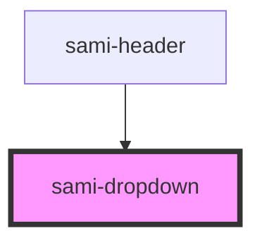

# sami-dropdown


<!-- Auto Generated Below -->


## Usage

### Angular

```html
<!-- Tag Card With Number -->
<sami-card-tag text="1"></sami-card-tag>
```


## Properties

| Property | Attribute | Description | Type                     | Default     |
| -------- | --------- | ----------- | ------------------------ | ----------- |
| `border` | `border`  |             | `boolean`                | `false`     |
| `data`   | `data`    |             | `IListGroup[] \| string` | `undefined` |
| `right`  | `right`   |             | `string`                 | `""`        |
| `text`   | `text`    |             | `string`                 | `""`        |
| `width`  | `width`   |             | `string`                 | `""`        |


## Dependencies

### Used by

 - [sami-header](../../../organims/headers/header)

### Graph


----------------------------------------------

*Built with [StencilJS](https://stenciljs.com/)*
