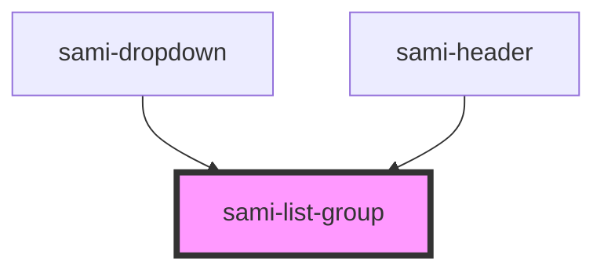

# sami-list-group


<!-- Auto Generated Below -->


## Usage

### Angular

```html
<!-- Tag Card With Number -->
<sami-card-tag text="1"></sami-card-tag>
```


## Properties

| Property      | Attribute      | Description | Type           | Default     |
| ------------- | -------------- | ----------- | -------------- | ----------- |
| `border`      | `border`       |             | `boolean`      | `false`     |
| `classAppend` | `class-append` |             | `string`       | `''`        |
| `data`        | --             |             | `IListGroup[]` | `undefined` |


## Dependencies

### Used by

 - [sami-dropdown](../../dropdowns/dropdown)
 - [sami-header](../../../organims/headers/header)

### Graph


----------------------------------------------

*Built with [StencilJS](https://stenciljs.com/)*
