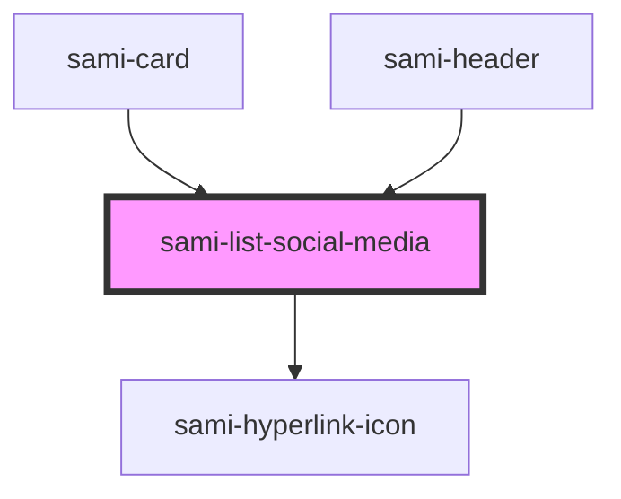

# sami-list-social-media


<!-- Auto Generated Below -->


## Usage

### Angular

```html
<!-- Tag Card With Number -->
<sami-card-tag text="1"></sami-card-tag>
```


## Properties

| Property        | Attribute        | Description | Type                 | Default     |
| --------------- | ---------------- | ----------- | -------------------- | ----------- |
| `classAppend`   | `class-append`   |             | `string`             | `''`        |
| `data`          | --               |             | `IListSocialMedia[]` | `[]`        |
| `filter`        | `filter`         |             | `string`             | `undefined` |
| `flexDirection` | `flex-direction` |             | `string`             | `undefined` |


## Dependencies

### Used by

 - [sami-card](../../../atoms/cards/card)
 - [sami-header](../../../organims/headers/header)

### Depends on

- [sami-hyperlink-icon](../../../atoms/hyperlinks/hyperlink-icon)

### Graph


----------------------------------------------

*Built with [StencilJS](https://stenciljs.com/)*
