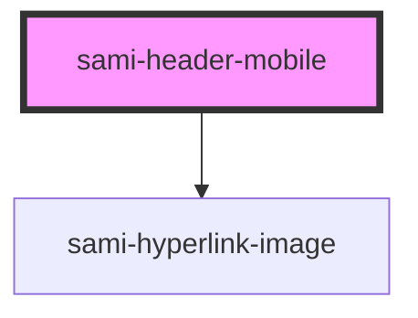

# sami-header-mobile


<!-- Auto Generated Below -->


## Usage

### Angular

```html
<!-- Tag Card With Number -->
<sami-card-tag text="1"></sami-card-tag>
```


## Properties

| Property                   | Attribute                    | Description | Type     | Default     |
| -------------------------- | ---------------------------- | ----------- | -------- | ----------- |
| `hyperlinkBackground`      | `hyperlink-background`       |             | `string` | `undefined` |
| `hyperlinkBackgroundImage` | `hyperlink-background-image` |             | `string` | `undefined` |
| `hyperlinkBorderRadius`    | `hyperlink-border-radius`    |             | `string` | `undefined` |
| `hyperlinkHeight`          | `hyperlink-height`           |             | `string` | `undefined` |
| `hyperlinkMaxWidth`        | `hyperlink-max-width`        |             | `string` | `undefined` |
| `hyperlinkTarget`          | `hyperlink-target`           |             | `string` | `undefined` |
| `hyperlinkUrl`             | `hyperlink-url`              |             | `string` | `undefined` |
| `hyperlinkWidth`           | `hyperlink-width`            |             | `string` | `undefined` |


## Dependencies

### Depends on

- [sami-hyperlink-image](../../../atoms/hyperlinks/hyperlink-image)

### Graph


----------------------------------------------

*Built with [StencilJS](https://stenciljs.com/)*
