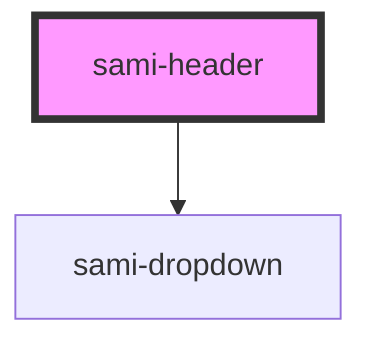

# sami-header


<!-- Auto Generated Below -->


## Usage

### Angular

```html
<!-- Tag Card With Number -->
<sami-card-tag text="1"></sami-card-tag>
```


## Properties

| Property                   | Attribute                    | Description | Type                           | Default     |
| -------------------------- | ---------------------------- | ----------- | ------------------------------ | ----------- |
| `backgroundColor`          | `background-color`           |             | `string`                       | `undefined` |
| `boxShadow`                | `box-shadow`                 |             | `string`                       | `undefined` |
| `desktop`                  | `desktop`                    |             | `boolean`                      | `undefined` |
| `dropdownBorder`           | `dropdown-border`            |             | `boolean`                      | `false`     |
| `dropdownListGroupData`    | `dropdown-list-group-data`   |             | `IListGroup[] \| string`       | `undefined` |
| `dropdownRight`            | `dropdown-right`             |             | `string`                       | `undefined` |
| `dropdownTitle`            | `dropdown-title`             |             | `string`                       | `undefined` |
| `dropdownWidth`            | `dropdown-width`             |             | `string`                       | `undefined` |
| `flexGrow`                 | `flex-grow`                  |             | `boolean`                      | `undefined` |
| `hyperlinkBackground`      | `hyperlink-background`       |             | `string`                       | `undefined` |
| `hyperlinkBackgroundImage` | `hyperlink-background-image` |             | `string`                       | `undefined` |
| `hyperlinkBorderRadius`    | `hyperlink-border-radius`    |             | `string`                       | `undefined` |
| `hyperlinkHeight`          | `hyperlink-height`           |             | `string`                       | `undefined` |
| `hyperlinkMaxWidth`        | `hyperlink-max-width`        |             | `string`                       | `undefined` |
| `hyperlinkTarget`          | `hyperlink-target`           |             | `string`                       | `undefined` |
| `hyperlinkUrl`             | `hyperlink-url`              |             | `string`                       | `undefined` |
| `hyperlinkWidth`           | `hyperlink-width`            |             | `string`                       | `undefined` |
| `justifyContent`           | `justify-content`            |             | `string`                       | `undefined` |
| `justifyContentMobile`     | `justify-content-mobile`     |             | `string`                       | `undefined` |
| `listGroupData`            | `list-group-data`            |             | `IListGroup[] \| string`       | `undefined` |
| `listSocialMediaData`      | `list-social-media-data`     |             | `IListSocialMedia[] \| string` | `undefined` |
| `position`                 | `position`                   |             | `string`                       | `undefined` |
| `top`                      | `top`                        |             | `string`                       | `undefined` |
| `zIndex`                   | `z-index`                    |             | `string`                       | `undefined` |


## Dependencies

### Depends on

- [sami-dropdown](../../../molecules/dropdowns/dropdown)

### Graph


----------------------------------------------

*Built with [StencilJS](https://stenciljs.com/)*
