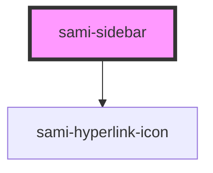

# sami-sidebar


<!-- Auto Generated Below -->


## Usage

### Angular

```html
<!-- Tag Card With Number -->
<sami-card-tag text="1"></sami-card-tag>
```


## Properties

| Property            | Attribute             | Description | Type     | Default     |
| ------------------- | --------------------- | ----------- | -------- | ----------- |
| `background`        | `background`          |             | `string` | `undefined` |
| `boxShadow`         | `box-shadow`          |             | `string` | `undefined` |
| `height`            | `height`              |             | `string` | `undefined` |
| `hyperlinkFilter`   | `hyperlink-filter`    |             | `string` | `undefined` |
| `hyperlinkPadding`  | `hyperlink-padding`   |             | `string` | `undefined` |
| `hyperlinkUrl`      | `hyperlink-url`       |             | `string` | `undefined` |
| `hyperlinkUrlImage` | `hyperlink-url-image` |             | `string` | `undefined` |
| `maxWidth`          | `max-width`           |             | `string` | `undefined` |
| `position`          | `position`            |             | `string` | `undefined` |
| `top`               | `top`                 |             | `number` | `undefined` |
| `width`             | `width`               |             | `string` | `undefined` |
| `zIndex`            | `z-index`             |             | `number` | `undefined` |


## Dependencies

### Depends on

- [sami-hyperlink-icon](../../../atoms/hyperlinks/hyperlink-icon)

### Graph


----------------------------------------------

*Built with [StencilJS](https://stenciljs.com/)*
