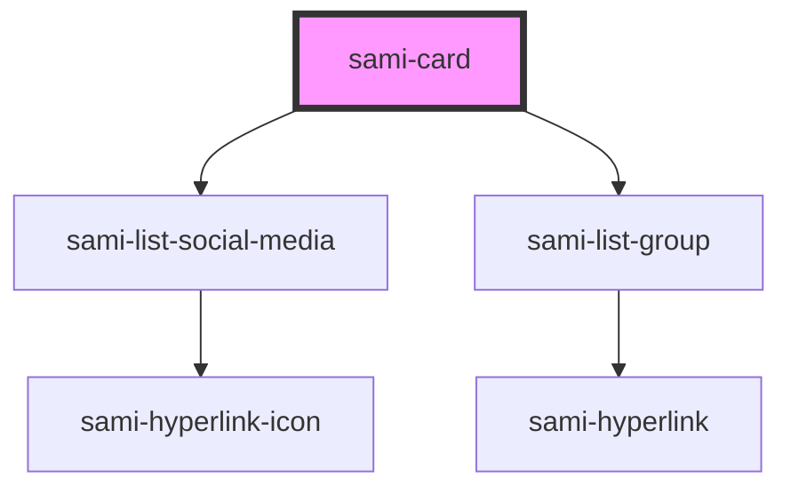

# sami-card


<!-- Auto Generated Below -->


## Usage

### Angular

```html
<!-- Tag Card With Number -->
<sami-card-tag text="1"></sami-card-tag>
```


## Properties

| Property               | Attribute                | Description                                                                                   | Type                           | Default     |
| ---------------------- | ------------------------ | --------------------------------------------------------------------------------------------- | ------------------------------ | ----------- |
| `background`           | `background`             | es: Sub título del card image en: Subtitle of card image Example: Css3                        | `string`                       | `''`        |
| `backgroundColor`      | `background-color`       |                                                                                               | `string`                       | `''`        |
| `borderColor`          | `border-color`           |                                                                                               | `string`                       | `''`        |
| `borderRadius`         | `border-radius`          |                                                                                               | `string`                       | `''`        |
| `cardResume`           | `card-resume`            |                                                                                               | `string`                       | `''`        |
| `cardSubtitle`         | `card-subtitle`          | es: Sub título del card image en: Subtitle of card image Example: Css3                        | `string`                       | `''`        |
| `cardTag`              | --                       |                                                                                               | `HTMLElement`                  | `undefined` |
| `cardTitle`            | `card-title`             | es: Título del card image en: Title of card image Example: Estilos                            | `string`                       | `''`        |
| `footerJustifyContent` | `footer-justify-content` |                                                                                               | `string`                       | `''`        |
| `imageHeight`          | `image-height`           |                                                                                               | `string`                       | `''`        |
| `imageMaxHeight`       | `image-max-height`       |                                                                                               | `string`                       | `''`        |
| `imageMaxWidth`        | `image-max-width`        |                                                                                               | `string`                       | `''`        |
| `imageObjectFit`       | `image-object-fit`       |                                                                                               | `string`                       | `''`        |
| `imageSrc`             | `image-src`              |                                                                                               | `string`                       | `''`        |
| `imageWidth`           | `image-width`            |                                                                                               | `string`                       | `''`        |
| `listGroupData`        | `list-group-data`        |                                                                                               | `IListGroup[] \| string`       | `undefined` |
| `listSocialMediaData`  | `list-social-media-data` |                                                                                               | `IListSocialMedia[] \| string` | `undefined` |
| `margin`               | `margin`                 |                                                                                               | `string`                       | `''`        |
| `marginBottom`         | `margin-bottom`          |                                                                                               | `string`                       | `''`        |
| `maxWidth`             | `max-width`              |                                                                                               | `string`                       | `''`        |
| `url`                  | `url`                    | es: Ruta que redirige del card image en: Route of redirect card image Example: localhost/css3 | `string`                       | `'#'`       |


## Dependencies

### Depends on

- [sami-list-social-media](../../../molecules/lists/list-social-media)
- [sami-list-group](../../../molecules/lists/list-group)

### Graph


----------------------------------------------

*Built with [StencilJS](https://stenciljs.com/)*
