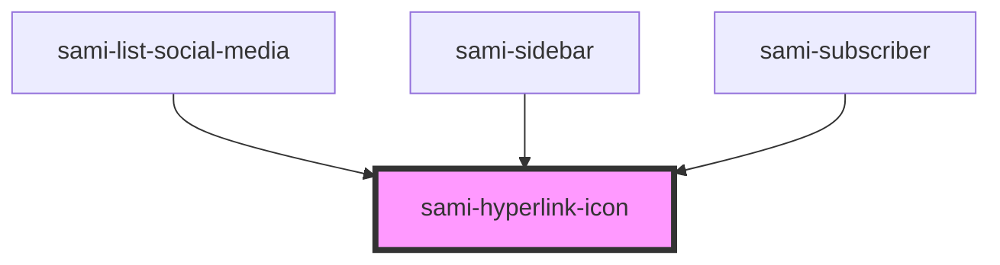

# sami-hyperlink-icon


<!-- Auto Generated Below -->


## Usage

### Angular

```html
<!-- Tag Card With Number -->
<sami-card-tag text="1"></sami-card-tag>
```


## Properties

| Property      | Attribute      | Description                                                                                   | Type         | Default     |
| ------------- | -------------- | --------------------------------------------------------------------------------------------- | ------------ | ----------- |
| `filter`      | `filter`       | es: Ruta que redirige del card image en: Route of redirect card image Example: localhost/css3 | `string`     | `undefined` |
| `fnClick`     | --             |                                                                                               | `() => void` | `() => { }` |
| `heightImage` | `height-image` | es: Ruta que redirige del card image en: Route of redirect card image Example: localhost/css3 | `number`     | `26`        |
| `padding`     | `padding`      | es: Ruta que redirige del card image en: Route of redirect card image Example: localhost/css3 | `string`     | `undefined` |
| `target`      | `target`       |                                                                                               | `string`     | `"_blank"`  |
| `type`        | `type`         | es: Ruta que redirige del card image en: Route of redirect card image Example: localhost/css3 | `string`     | `'github'`  |
| `url`         | `url`          | es: Ruta que redirige del card image en: Route of redirect card image Example: localhost/css3 | `string`     | `'#'`       |
| `urlImage`    | `url-image`    |                                                                                               | `string`     | `""`        |
| `width`       | `width`        |                                                                                               | `string`     | `undefined` |
| `widthImage`  | `width-image`  | es: Ruta que redirige del card image en: Route of redirect card image Example: localhost/css3 | `number`     | `26`        |


## Dependencies

### Used by

 - [sami-list-social-media](../../../molecules/lists/list-social-media)
 - [sami-sidebar](../../../organims/sidebars/sidebar)
 - [sami-subscriber](../../../organims/subscribers/subscriber)

### Graph


----------------------------------------------

*Built with [StencilJS](https://stenciljs.com/)*
