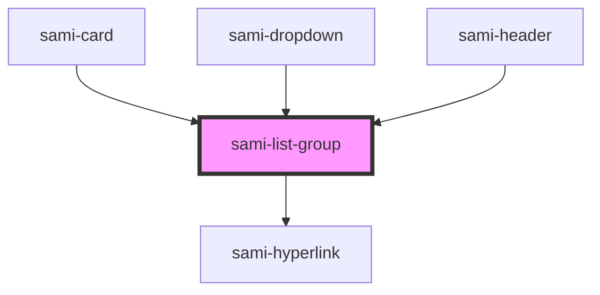

# sami-list-group


<!-- Auto Generated Below -->


## Usage

### Angular

```html
<!-- Tag Card With Number -->
<sami-card-tag text="1"></sami-card-tag>
```


## Properties

| Property        | Attribute        | Description | Type           | Default     |
| --------------- | ---------------- | ----------- | -------------- | ----------- |
| `border`        | `border`         |             | `boolean`      | `false`     |
| `classAppend`   | `class-append`   |             | `string`       | `''`        |
| `data`          | --               |             | `IListGroup[]` | `undefined` |
| `display`       | `display`        |             | `string`       | `undefined` |
| `flexDirection` | `flex-direction` |             | `string`       | `undefined` |
| `width`         | `width`          |             | `string`       | `undefined` |


## Dependencies

### Used by

 - [sami-card](../../../atoms/cards/card)
 - [sami-dropdown](../../dropdowns/dropdown)
 - [sami-header](../../../organims/headers/header)

### Depends on

- [sami-hyperlink](../../../atoms/hyperlinks/hyperlink)

### Graph


----------------------------------------------

*Built with [StencilJS](https://stenciljs.com/)*
