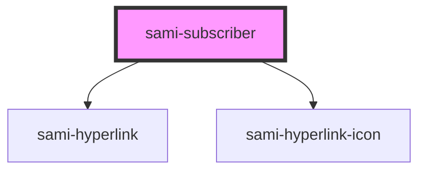

# sami-subscriber


<!-- Auto Generated Below -->


## Usage

### Angular

```html
<!-- Tag Card With Number -->
<sami-card-tag text="1"></sami-card-tag>
```


## Properties

| Property                | Attribute                  | Description | Type     | Default     |
| ----------------------- | -------------------------- | ----------- | -------- | ----------- |
| `background`            | `background`               |             | `string` | `undefined` |
| `boxShadow`             | `box-shadow`               |             | `string` | `undefined` |
| `height`                | `height`                   |             | `string` | `undefined` |
| `hyperlinkFilter`       | `hyperlink-filter`         |             | `string` | `undefined` |
| `hyperlinkIconHeight`   | `hyperlink-icon-height`    |             | `number` | `undefined` |
| `hyperlinkIconPadding`  | `hyperlink-icon-padding`   |             | `string` | `undefined` |
| `hyperlinkIconUrlImage` | `hyperlink-icon-url-image` |             | `string` | `undefined` |
| `hyperlinkIconWidth`    | `hyperlink-icon-width`     |             | `number` | `undefined` |
| `hyperlinkPadding`      | `hyperlink-padding`        |             | `string` | `undefined` |
| `hyperlinkText`         | `hyperlink-text`           |             | `string` | `undefined` |
| `hyperlinkUrl`          | `hyperlink-url`            |             | `string` | `"#"`       |
| `maxWidth`              | `max-width`                |             | `string` | `undefined` |
| `position`              | `position`                 |             | `string` | `undefined` |
| `top`                   | `top`                      |             | `number` | `undefined` |
| `width`                 | `width`                    |             | `string` | `undefined` |
| `zIndex`                | `z-index`                  |             | `number` | `undefined` |


## Dependencies

### Depends on

- [sami-hyperlink](../../../atoms/hyperlinks/hyperlink)
- [sami-hyperlink-icon](../../../atoms/hyperlinks/hyperlink-icon)

### Graph


----------------------------------------------

*Built with [StencilJS](https://stenciljs.com/)*
